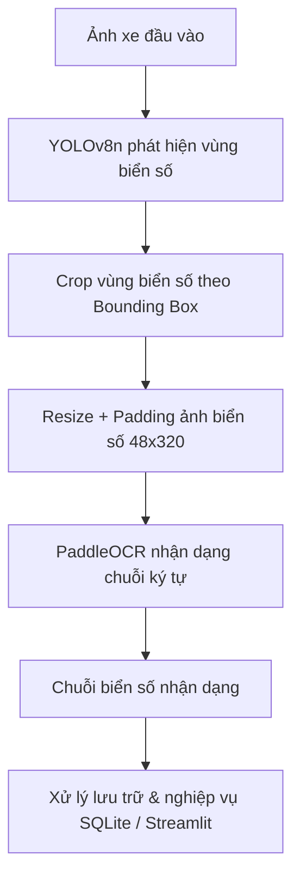

# 🚗 Hệ Thống Quản Lý Xe Ra Vào Tự Động Cho Bãi Giữ Xe Nhỏ

Hệ thống ứng dụng kĩ thuật Thị giác máy tính (Computer Vision) và Học sâu (Deep Learning) để tự động hóa quy trình quản lý xe ra vào bãi. Hệ thống kết hợp **YOLOv8n** cho bài toán phát hiện vị trí biển số xe và **PaddleOCR (PP-OCRv4)** cho bài toán nhận dạng chuỗi ký tự.

## 📌 1. Quy Trình Hoạt Động (Pipeline)

Quy trình nhận dạng và quản lý xe ra vào được thực hiện qua các bước chính:



**Quy trình nghiệp vụ ra/vào bãi:**
(Chi tiết sơ đồ khối xử lý xe vào, xe ra và tính phí thanh toán)

## 🛠️ 2. Công Nghệ Sử Dụng

- **Ngôn ngữ:** Python
- **Phát hiện biển số (Detection):** Ultralytics YOLOv8n
- **Nhận dạng ký tự (OCR):** PaddleOCR (PP-OCRv4 Recognition, kiến trúc SVTR_LCNet)
- **Xử lý ảnh:** OpenCV
- **Giao diện Web App:** Streamlit
- **Cơ sở dữ liệu:** SQLite

## 📊 3. Dữ Liệu Thực Nghiệm & Tiền Xử Lý

### 3.1. Dữ liệu huấn luyện YOLO

- **Tổng số mẫu:** 4.577 ảnh (chứa 4.578 đối tượng biển số).
- **Phân chia dữ liệu:** Train (80% - 3.632 ảnh), Validation (10% - 472 ảnh), Test (10% - 473 ảnh).

### 3.2. Dữ liệu huấn luyện OCR

- **Nguồn dữ liệu:** Kết hợp dữ liệu Vietnamese License Plate OCR (11.096 ảnh) và các mẫu cắt từ dữ liệu YOLO.
- **Tổng bộ dữ liệu OCR:** 12.515 ảnh.
- **Xử lý mất cân bằng dữ liệu:**
  - Chuẩn hóa nhãn (loại bỏ gạch ngang, khoảng trắng, chuyển in hoa).
  - Bổ sung dữ liệu ký tự hiếm (R, S, U, V, X, Y, Z).
  - Cân bằng tập Train bằng Data Augmentation (xoay ảnh, chỉnh độ sáng/tương phản, nhiễu nhẹ).
  - Thống nhất kích thước ảnh đầu vào 48×320 bằng phương pháp Resize + Padding giữ nguyên tỷ lệ gốc.

## 📈 4. Kết Quả Huấn Luyện & Đánh Giá

### 4.1. Mô hình YOLOv8n (Phát hiện biển số)

Mô hình huấn luyện trên Google Colab GPU trong 100 epochs (Batch size 16, Image size 640).

**Kết quả trên tập Test (473 ảnh / 553 biển số):**

| Chỉ số | Giá trị |
|---|---|
| Precision | 0.9558 |
| Recall | 0.8608 |
| mAP50 | 0.8610 |
| mAP50-95 | 0.7689 |
| Tốc độ suy luận (Inference) | ~44.0 ms/ảnh (đáp ứng thời gian thực) |

**Biểu đồ đánh giá huấn luyện YOLOv8n:**

- Đường cong F1, Precision, Recall & PR-Curve:
- Ma trận nhầm lẫn (Confusion Matrix) trên tập Test:

### 4.2. Mô hình PaddleOCR (Nhận dạng ký tự)

Huấn luyện 50 epochs trên Google Colab GPU (Batch size 64, Learning rate 0.0005, kết hợp CTCLoss & NRTRLoss).

**Kết quả qua các Epoch:**

- Epoch 1: Accuracy = 0.0000, Norm Edit Distance = 0.1878
- Epoch 50: Accuracy = 0.9453, Norm Edit Distance = 0.9891, CTC Loss = 0.2902

**Đánh giá trên tập kiểm thử:**

| Tập dữ liệu | Số mẫu | Accuracy | Norm Edit Distance |
|---|---|---|---|
| Validation | 1.253 | 0.856 | 0.960 |
| Test | 1.252 | 0.856 | 0.952 |

**Biểu đồ quá trình huấn luyện OCR**

**Thống kê lỗi trên tập Test theo từng ký tự**

> **Nhận xét:** Các chữ số (0, 1, 3, 8) có số lần sai tuyệt đối cao do tần suất xuất hiện lớn. Ngược lại, các chữ cái ít xuất hiện (N, P, V, X) có tỷ lệ sai tương đối cao (>10%).

## 🖥️ 5. Giao Diện Demo Ứng Dụng (Streamlit)

Ứng dụng được thiết kế hoàn chỉnh các chức năng quản lý bãi giữ xe:

| Chức năng | Mô tả |
|---|---|
| Đăng nhập quản trị | Giao diện bảo mật đăng nhập |
| Lưu xe vào bãi | Tải ảnh/chụp camera, tự nhận dạng biển số & gợi ý loại xe |
| Lưu xe ra bãi | Đối chiếu biển số, tính số giờ gửi & tổng tiền vé |
| Tổng kết doanh thu | Thống kê tổng xe, lượt gửi, doanh thu & xuất CSV |
| Cấu hình giá vé | Thiết lập block giờ đầu và đơn giá cho xe máy/ô tô |

## 🚀 6. Hướng Dẫn Cài Đặt & Khởi Chạy

### Yêu cầu hệ thống

- Python >= 3.9
- GPU (khuyến khích nếu dùng huấn luyện) hoặc CPU (cho giao diện suy luận Streamlit)

### Cài đặt

1. Clone repository:

   ```bash
   git clone https://github.com/your-username/parking-management-system.git
   cd parking-management-system
   ```

2. Cài đặt thư viện phụ thuộc:

   ```bash
   pip install -r requirements.txt
   ```

3. Chạy ứng dụng Web Streamlit:

   ```bash
   streamlit run app.py
   ```

4. Truy cập đường dẫn localhost hiển thị trên Terminal (mặc định: http://localhost:8501).

## 📝 Thông Tin Tác Giả

- **Sinh viên thực hiện:** Phan Xuân Dương (MSSV: 2386400966 - Lớp: 23DKHA1)
- **Giảng viên hướng dẫn:** ThS. Nguyễn Quang Phúc
- **Trường:** Đại học Công nghệ TP.HCM (HUTECH) - Khoa Công Nghệ Thông Tin
